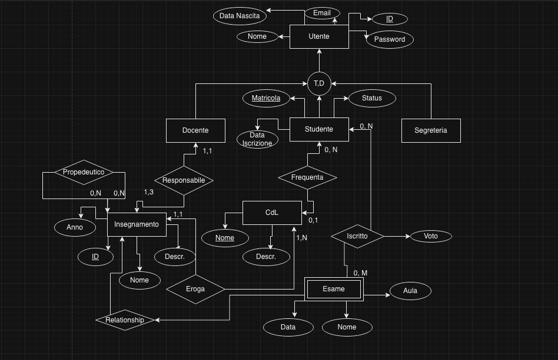
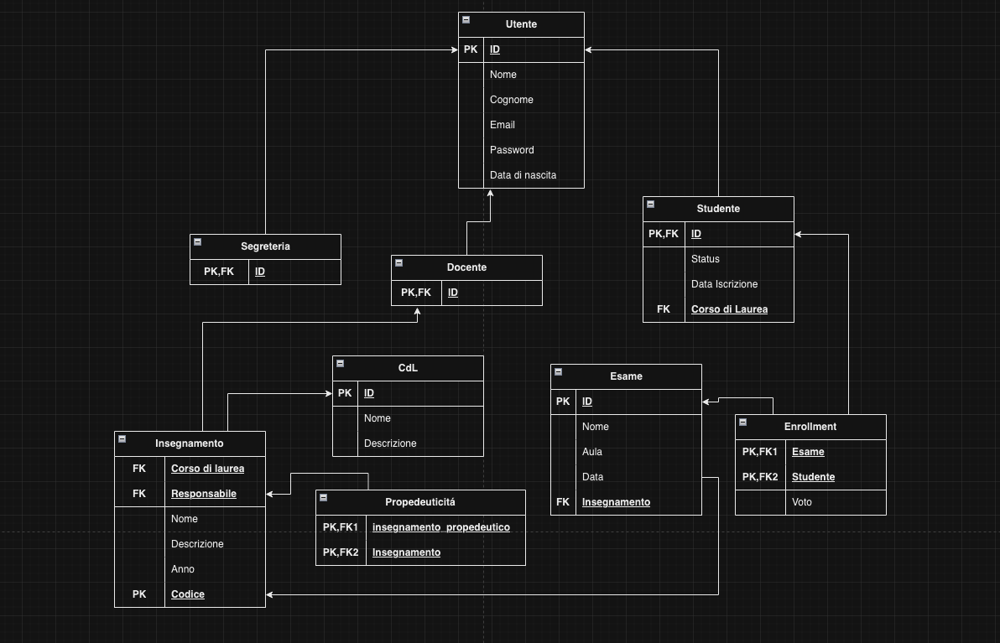
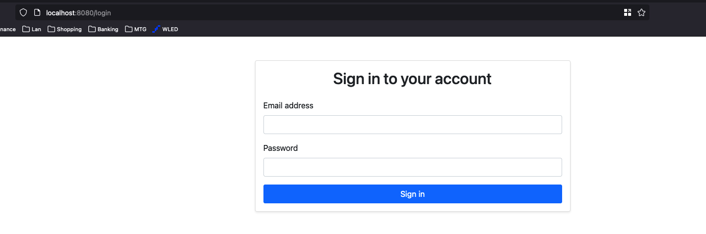
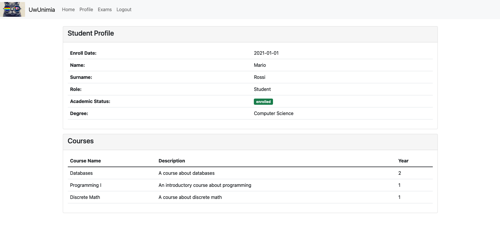
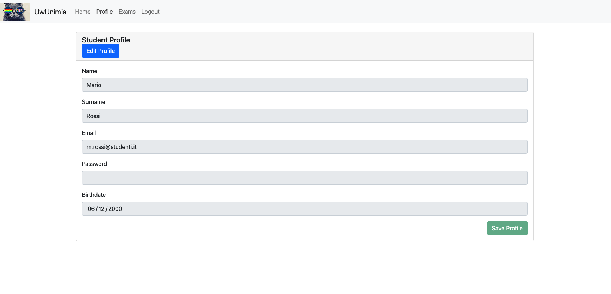
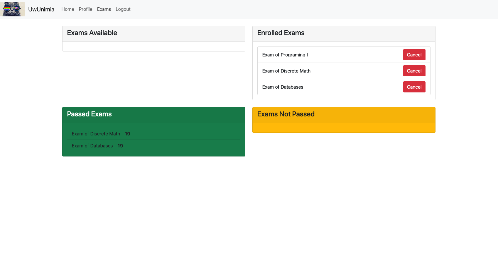

# Documentazione Tecnica

Descrizione del funzionamento del software nelle sue parti. Partendo
dallo Schema fino al funzionamento dell'applicativo.

## Schema ER



## Logic Schema



## Application Implementation details

UwUnimia usa un classico framework MVC (ModelViewController), dove le
rotte vengono gestite dal controller, il quale chiama il modello per
gestire la parte di "business" ed infine ritorna una view come response.

In particolare si parte da una rotta (es `/students`)

```php
    $app->group('/student', function (RouteCollectorProxy $group) {
        $group->get('', \UwUnimia\Action\StudentAction::class);
        $group->get('/exams', [\UwUnimia\Action\StudentAction::class, 'getExams']);
```

Quando verra richiesta la rotta, questa verra gestita dal controller
`StudentAction`, il quale automaticamente chiama il metodo `__invoke`

```php
    public function __invoke(Request $request, Response $response): Response
    {
        $this->logger->info("Student Action Dispatched");
        $degreeInfo = $this->student->getDegreesInfo($this->studentID);
        $studentInfo = $this->student->getProfileInfo($this->studentID);

        $this->logger->info(json_encode($degreeInfo));
        return $this->render($request, $response, 'student/student.twig',
                             [
                                 'role' => $_SESSION['role'],
                                 'degree' => $degreeInfo,
                                 'student' => $studentInfo,
                             ]
        );
    }

```

Che va a chiamare il modello, tramite `$this->student->`

La quale non fa altro che fare una query a DB per ritornare un po di
informazioni generiche

```php
    public function getDegreesInfo($id) {
        $sql = $this->db->prepare('select d.name as degree, c.name, c.description, c.year from student s left join degree d on d.id = s.degree left join course c on c.degree = d.id where s.id = :id');
        $sql->bindValue(':id', $id);
        $sql->execute();

        return $sql->fetchAll();
    }
```

Infine viene ritornata la view, che in questo caso sarebbe un `twig`
file che genera HTML.

### HTMX

Utilizzo [HTMX](https://htmx.org/) per gestire le chiamate a backend
dal frontend. Questo mi permette di dare l'impressione di usare una
SPA (SinglePageApplication), andando a sostituire solo l'HTML
necessario invece che l'intera pagina.

# Documentazione Utente

Overview dell'utilizzo della piattaforma

## Login

- Studente:
  Utente: m.rossi@studenti.it
  Password: `mariopassword`
- Insegnante:
  Utente: p.baudo@professori.it
  Password: `pippopassword`
- Segreteria:
  Utente: r.strapozzo@segreteria.it
  Password: `roccopassword`



## Studente






